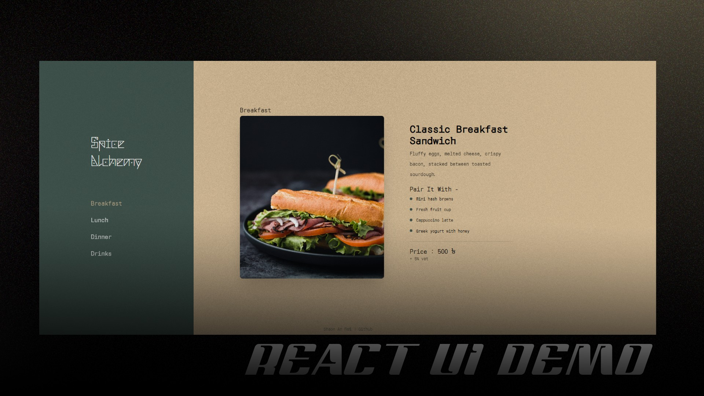

# React Restaurant Menu Demo 🍽️



A modern front-end demonstration showcasing a dynamic restaurant menu interface built with React and styled with Tailwind CSS. Features smooth animations powered by Framer Motion and an optional noise overlay effect using React Three Fiber.

## ✨ Features

- **Dynamic Content:** Displays different food items selected from a sidebar.
- **Responsive Design:** Adapts layout for various screen sizes (mobile, tablet, desktop).
- **Smooth Animations:** Utilizes Framer Motion for elegant transitions between content sections and image loading.
- **Interactive Sidebar:** Allows users to select different menu items.
- **Visual Effects:** Includes an optional configurable noise/grain overlay for a vintage aesthetic (using React Three Fiber or CSS).
- **Modern Styling:** Styled with Tailwind CSS for a clean and utility-first approach.

## 🚀 Technologies Used

- **React:** JavaScript library for building user interfaces.
- **Tailwind CSS:** Utility-first CSS framework for rapid styling.
- **Framer Motion:** Animation library for React.
- **(Optional) React Three Fiber / Three.js:** For the WebGL-based noise overlay effect.
- **Vite (Assumed):** Fast front-end build tool.

## 🛠️ Setup & Running

1.  **Clone the repository:**
    ```bash
    git clone <your-repository-url>
    cd sidebar
    ```
2.  **Install dependencies:**
    ```bash
    npm install
    # or
    yarn install
    ```
3.  **Run the development server:**
    ```bash
    npm run dev
    # or
    yarn dev
    ```
4.  Open your browser and navigate to `http://localhost:5173` (or the port specified by Vite).

## 🎨 Customization

- **Food Data:** Modify `src/data/fooddata.js` to change menu items.
- **Styling:** Adjust Tailwind classes in components or configure `tailwind.config.js`.
- **Noise Overlay:**
  - Enable/disable or configure the `<NoiseOverlay />` component in `src/components/pages/homepage.jsx`.
  - Adjust shader parameters within `src/components/ui/NoiseOverlay.jsx` or the props passed to it.
  - Alternatively, use the CSS image overlay defined in `src/index.css` and `src/components/pages/homepage.jsx`.

---

_Built by Shaon An Nafi_
_([GitHub](https://github.com/Nafisarkar))_
